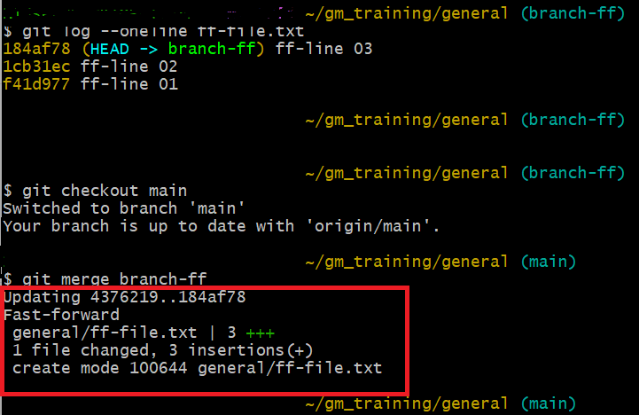
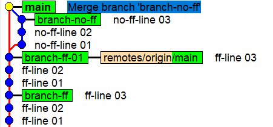

## Git Merge Fast Forward from main to feature-ff

### Fast-Forward Merge - see the steps below:
  - Create and checkout a new branch (branch-ff)
  - Create ff-file.txt
  - Create three commits in the branch-ff branch
  - Move to the main branch
  - Merge the branch-ff branch into the main branch
    - You can run below commands via the merge-ff.sh or merge-ff-arg.sh bash script
 
    
```
git checkout -b branch-ff
echo "ff-line 01" >> ff-file.txt
git add ff-file.txt
git commit -m "ff-line 01"
echo "ff-line 02" >> ff-file.txt
git add ff-file.txt
git commit -m "ff-line 02"
echo "ff-line 03" >> ff-file.txt
git commit -am "ff-line 03"
git log --oneline ff-file.txt

git checkout main
git merge branch-ff
git log --oneline ff-file.txt
gitk
```
- Output
  
 


### Merge with --no-ff
- Create and checkout a new branch (branch-no-ff):
- Create no-ff-file.txt
- Create three commits in the branch-no-ff branch
- Move to the main branch:
- Merge the branch-ff branch into the main branch

```
git checkout -b branch-no-ff
echo "ff-line 01" >> no-ff-file.txt
git add no-ff-file.txt
git commit -m "no-ff-line 01"
echo "no-ff-line 02" >> no-ff-file.txt
git add no-ff-file.txt
git commit -m "no-ff-line 02"
echo "no-ff-line 03" >> no-ff-file.txt
git commit -am "no-ff-line 03"
git log --oneline no-ff-file.txt

git checkout main
git merge branch-no-ff --no-ff
git log --oneline no-ff-file.txt
gitk

```

- Output
  
 


### Git Rebase

- Create two commits in the main branch
- Create and checkout a new branch (branch-rebase-demo)
- Create one commits in the branch-rebase-demo branch
- rebase the branch-rebase-demo branch into the main branch

```
git checkout main
echo "line 01" > rebase-demo.txt		# Pay attantion its not append mode, otherway you will get conflict 
git add rebase-demo.txt
git commit -m "main line-01"
echo "line 02" >> rebase-demo.txt
git commit -am "main line-02"
git log --oneline rebase-demo.txt
gitk

git checkout -b branch-rebase-demo
echo "line 03" >> rebase-demo.txt
git add rebase-demo.txt
git commit -am "branch-rebase-demo line-03"
git log --oneline rebase-file.txt
gitk

git checkout main
git rebase branch-rebase-demo
git log --oneline rebase-file.txt
gitk

	##### END #############
```
- output

 


## Git Rebase interactive

- Add base commit on main
- Create rebase-interactive branch
- Add two commits to squash later
- Show log before squash
- Interactive rebase (squash last 2)
- Show log after squash
- Rebase branch-rebase-interactive branch into main
  
```
echo "line 01" >> rebase-interactive.txt
cat rebase-interactive.txt
git add rebase-interactive.txt
git commit -m "main line-01"

git checkout -b branch-rebase-interactive
echo "line 02" >> rebase-interactive.txt
git commit -am "brach-rebase-interactive line-02"
cat rebase-interactive.txt
echo "line 03" >> rebase-interactive.txt
git commit -am "brach-rebase-interactive line-03"
git log --oneline rebase-interactive.txt
gitk

		# Interactive rebase (squash last 2)
git rebase -i HEAD~2
		# Log after squash
cat rebase-interactive.txt
git log --oneline rebase-interactive.txt
gitk
		# from main
git checkout -
cat rebase-interactive.txt
git log --oneline rebase-interactive.txt

	# Rebase branch-rebase-interactive branch into main
git rebase branch-rebase-interactive
git log --oneline rebase-interactive.txt
cat rebase-interactive.txt

```


