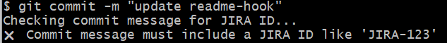
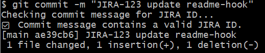

### Git hook 

- Hooks live in the .git/hooks/ directory of every Git repository.
When you initialize a repo, Git puts sample scripts there (e.g., commit-msg).

```
cd .git/hooks/
cp commit-msg.sample commit-msg
```

- **vi commit-msg** and add below contant
  
```
#!/bin/sh
echo "Checking commit message for JIRA ID..."

# Ensure a commit message file was passed
if [ -z "$1" ]; then
  echo "❌ No commit message file provided."
  exit 1
fi

# Read the commit message from the file Git passes as $1
commit_msg=$(cat "$1")

# Require a JIRA ID like "JIRA-123"
if ! echo "$commit_msg" | grep -qE '\bJIRA-[0-9]+\b'; then
  echo "❌ Commit message must include a JIRA ID like 'JIRA-123'"
  exit 1
fi

echo "✅ Commit message contains a valid JIRA ID."
```

- vi index.html
- git add index.html
- git commit -m "fix typo bug-123"              

- You should get an error message

 

- vi index.html
- git add index.html
- git commit -m "JIRA-123 fix typo bug-123"    		

- You should get a success message Commit message contains a valid JIRA ID

 

